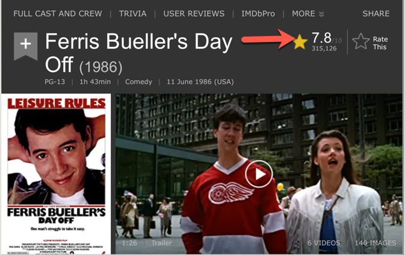
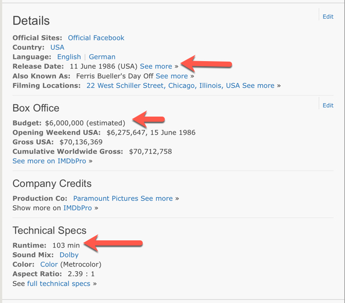
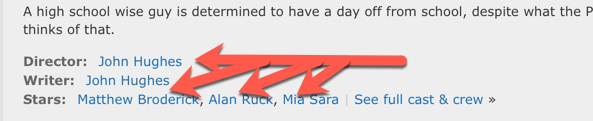

# IMDB Star Rating Predictor

## Description

This project develops a [linear regression](https://en.wikipedia.org/wiki/Linear_regression) based model to predict star ratings for movies featured on [IMDB](imdb.com).

## Features and Target Variables

The [dependent variable](https://en.wikipedia.org/wiki/Dependent_and_independent_variables) in this model is the IMDB star rating:

I used the following aspects of the movie as [features](https://en.wikipedia.org/wiki/Feature_(machine_learning)) of the model to predict the above dependent value:

along with these details of the movie:

Along with whether or not the director or any of the stars ever won an Academy Award for [Best Director](https://en.wikipedia.org/wiki/Academy_Award_for_Best_Director), [Best Actor](https://en.wikipedia.org/wiki/Academy_Award_for_Best_Actor), or [Best Actress](https://en.wikipedia.org/wiki/Academy_Award_for_Best_Actress) anytime between 2010 and 2019.

I also employed a synthetic feature: $$log(Budget)$$

## Data Used

I scraped 4000 movies from IMDB.com. I scraped movies that were released in the USA anytime between January 1, 2010 to December 31, 2019.

## Tools Used

The model was developed with the following tools:

* python (version 3.8.3)
* jupyter lab (2.2.6)
* bs4 (4.9.1)
* requests (2.24.0)
* sklearn (0.23.2)
* [Omni Graffle Pro](https://www.omnigroup.com/omnigraffle)
* A PDF file viewer (Acrobat)
* Microsoft Powerpoint
* emacs (or some other preferred text editor)

Along with a slew of other modules. Please see the python module requirements file (`conda_requirements.yml`) for a complete listing of everything you'll need to install if you would like to run this project.

## Description of Files

* `Project2.ipynb`: The jupyter notebook that contains the web scrapping software, [EDA](https://en.wikipedia.org/wiki/Exploratory_data_analysis), model selection, and final model testing and evaluation code.
* `my_project_notes.md`: Unofficial notes about the project that I wanted to keep under revision control. You can read through them but they are not required reading to understand the project or how to get it up and running
* `README.md`: This README file.
* `Project2_Diagrams.graffle`: Diagrams used or not used in documentation
* `Michael_Green_Metis_Project2.pdf`: Presentation of this project in PDF format
* `Michael_Green_Metis_Project2.pptx`: Presentation of this project in Powerpoint format
* `mymovie.py`: Module that contains a class definition required to run `Project2.ipynb`
* `conda_requirements.yml`: YML file you can use to setup the virtual environment required to run the project.
* `investigate_imdb_data_scrape_quality.ipynb`: A jupyter notebook I used to investigate issues I encountered while scraping IMDB. This notebook is not required for the project.

## Steps to reproduct this project

1. clone this repo
1. if you are using Anaconda Python run this command: `conda env create -f conda_requirements.yml`
1. Once that's done you should be able to start jupyter lab with this command: `jupyter lab`
1. Within Jupyter Lab open the notebook file `Project2.ipynb`
1. You should be able to run the cells. I suggest you read through the notebook. You will first have to run the scraping section of the notebook and then run the subsequent sections. Note it took me 14 hours to scrape the movie data I needed. [YMMV](https://www.allacronyms.com/YMMV/Your_Mileage_May_Vary) depending on how many movies you want to scrape, along with other settings you can choose within the notebook.

The project was developed and tested on a [Mac](https://www.apple.com/macbook-pro-16/) using macOS 10.15.7. It has not been tested on Windows or Linux, yet.

## Possible Impacts of Project

Hopefully someone will find this work interesting and suggest ways it could be improved or enhanced with new features.